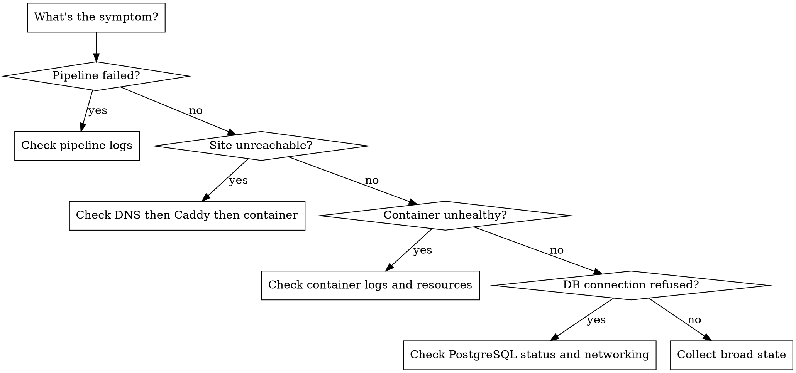

# Incident Response

## Overview

When something breaks, observe first, then narrow down. Don't guess. Don't restart blindly. Collect state, identify the failing component, find the root cause, fix it, then document what happened.

## When to Use

- Deploy workflow failed
- Container is crash-looping or unhealthy
- HTTPS/TLS not working
- Database connection refused
- Pipeline job failing unexpectedly
- Health endpoint returning errors
- "It was working before and now it's not"

## Triage Entry Point



## Diagnostic Commands by Component

### Container State
```bash
docker ps -a                          # All containers, including stopped
docker inspect <container>            # Full container config and state
docker logs <container> --tail 100    # Recent logs
docker stats --no-stream              # Resource usage snapshot
```

### Caddy (Phase 1-2)
```bash
systemctl status caddy                # Service state
journalctl -u caddy --since "1h ago"  # Recent Caddy logs
curl -I https://yourdomain.dev        # Test HTTPS response
curl -I http://localhost:3001/api/health  # Test backend directly (bypass Caddy)
```

### PostgreSQL
```bash
docker compose -f compose/docker-compose.yml exec postgres pg_isready  # Connection check
docker compose -f compose/docker-compose.yml logs postgres --tail 50   # Recent logs
```

### DNS / TLS
```bash
dig yourdomain.dev                    # DNS resolution
curl -vI https://yourdomain.dev 2>&1 | grep -E "SSL|subject|issuer"  # Cert details
```

### VPS Resources
```bash
free -h                               # Memory usage
df -h                                 # Disk usage
docker system df                      # Docker disk usage
```

### Pipeline
```bash
gh run list --repo Mountain-Dr3w/infra --limit 5    # Recent workflow runs
gh run view <run-id> --log-failed                   # Failed job logs
```

## Diagnostic Process

1. **Collect state** — Run the relevant diagnostic commands above. Don't change anything yet.
2. **Identify the failing component** — Is it DNS, TLS, reverse proxy, container, database, or pipeline?
3. **Check the obvious** — Is the service running? Is there disk space? Did a deploy just happen?
4. **Read the logs** — The answer is almost always in the logs. Read them before theorizing.
5. **Narrow to root cause** — Follow the error chain backward from symptom to source.
6. **Fix or rollback** — If the fix is clear, apply it. If not, rollback first to restore service, then debug.

## Rollback Procedures

Reference: `docs/runbook.md`

**Roll back a deploy (Compose):**
```bash
cd /opt/infra
export IMAGE_TAG=sha-<previous-good-sha>
docker compose -f compose/docker-compose.yml -f compose/enforcer/docker-compose.yml up -d enforcer-backend
```

**Restore database from backup:**
```bash
ls -la /home/deploy/backups/   # Find the backup
docker compose -f compose/docker-compose.yml exec -T postgres \
    psql -U enforcer enforcer_dev < /home/deploy/backups/pre-migrate-TIMESTAMP.sql
```

## Post-Incident Checklist

After resolving an incident:

- [ ] Root cause identified and documented
- [ ] Fix applied (or rollback in place while proper fix is developed)
- [ ] Verify the fix — check the same health endpoints/logs that showed the failure
- [ ] Update `docs/primer.md` if this reveals a systemic issue or new known issue
- [ ] Update `docs/runbook.md` if the resolution should be documented for future reference
- [ ] Consider whether a pipeline gate or health check could have caught this earlier
