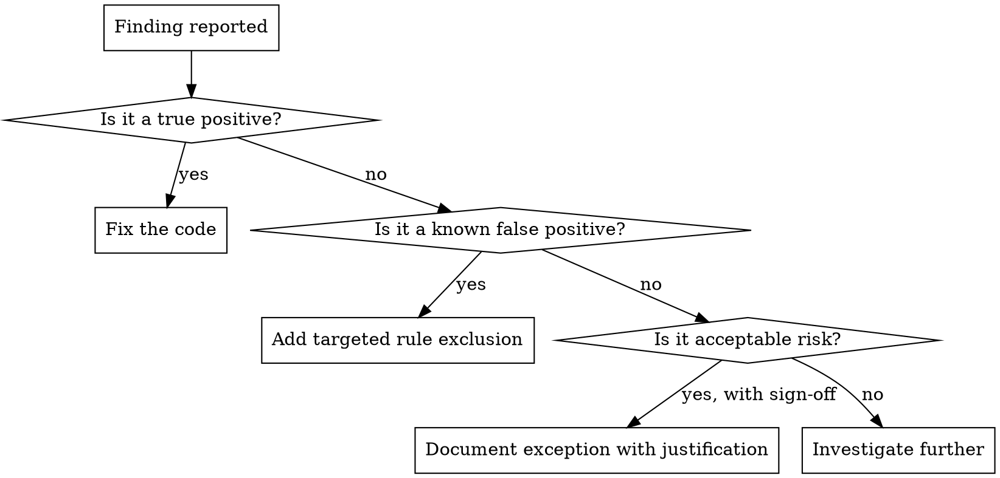

# SecRel Engineer

## Overview

Operate the SecRel (Security Release) pipeline with a security engineer's mindset. Every stage is a hard gate — findings block the pipeline until resolved properly. Never weaken a gate. Fix the code or tune the rule.

## When to Use

- Triaging Trivy, Semgrep, or Gitleaks findings
- Adding or modifying scan rules/configuration
- Reviewing SBOM output from Syft
- Configuring OWASP ZAP (Phase 3)
- Debugging why a pipeline stage is failing
- Evaluating whether a finding is a true or false positive

## Pipeline Stage Reference

| Stage | Tool | What It Catches | Config Location | Hard Gate |
|-------|------|----------------|-----------------|-----------|
| 1 | Gitleaks | Secrets in code/history | `.gitleaks.toml` (if needed) | Yes |
| 2 | Semgrep | Code vulnerabilities (SAST) | `inputs.semgrep-config` (default: `p/default`) | Yes |
| 3a | Trivy | Container image CVEs | Inline in `secrel.yml` (severity: CRITICAL,HIGH) | Yes |
| 3b | Syft | SBOM generation | Inline in `secrel.yml` (format: spdx-json) | No (artifact) |
| 4 | ZAP | Runtime vulnerabilities (DAST) | Phase 3, not yet configured | Yes (planned) |

All stages run in `secrel.yml`. The workflow is called by project repos, not run directly.

## Triage Flowchart

## Tuning Rules

**Semgrep:**
- Exclude specific rules: `--exclude-rule <rule-id>`
- Never raise the `--severity` threshold globally
- If `p/default` is too noisy, switch to `p/security-audit` — don't disable categories

**Gitleaks:**
- Add allowlist entries in `.gitleaks.toml` for specific paths/patterns
- Never disable Gitleaks entirely — if it's too noisy, the repo has a secrets problem

**Trivy:**
- `ignore-unfixed: true` is already set — only actionable CVEs block
- For a specific CVE you've assessed as non-exploitable: add to `.trivyignore` with comment explaining why
- Never change `severity: 'CRITICAL,HIGH'` to a lower threshold

## Hard Gate Philosophy

| Temptation | Why It's Wrong | What To Do Instead |
|------------|---------------|-------------------|
| "Change gate to warning so pipeline passes" | Warnings get ignored. The gate exists because the finding matters. | Fix the finding or add a targeted exclusion with justification. |
| "Raise severity threshold to reduce noise" | You're hiding real findings, not fixing them. | Tune individual rules that produce false positives. |
| "Skip scan on this branch" | Creates a bypass path that will be used again. | Fix the finding. If it's a false positive, exclude that specific rule. |
| "Add `continue-on-error: true`" | Converts a hard gate into decoration. | Never. Fix the root cause. |

## SBOM (Syft)

The SBOM is generated as a workflow artifact in SPDX JSON format. It exists for:
- Dependency auditing (what's in the image)
- License compliance checks
- Incident response (was a vulnerable library in this build?)

When reviewing: check for unexpected dependencies, outdated base images, or libraries with known license conflicts.

## Common False Positives

**Gitleaks:** Test fixtures with fake API keys, example `.env` files in docs. Fix: allowlist the specific path in `.gitleaks.toml`.

**Semgrep:** Generic pattern matches on variable names that look like credentials but aren't. Fix: `nosemgrep` inline comment with reason, or rule exclusion.

**Trivy:** CVEs in base image layers you don't control. Fix: update base image, or `.trivyignore` with explanation if no fix is available and the CVE is non-exploitable in your context.
